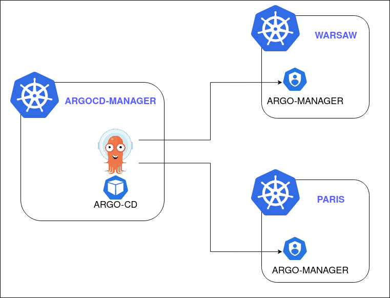
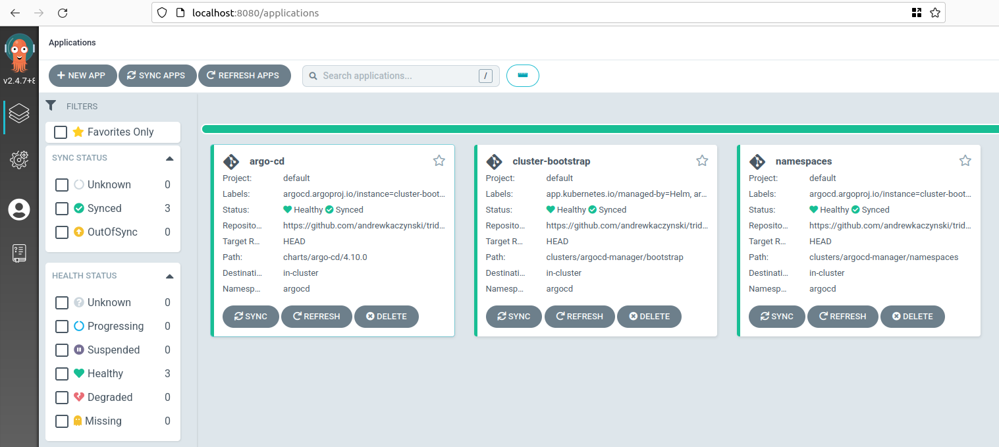

# ARGO CD APPLICATIONSET LAB

Welcome to the repository with Argo CD ApplicationSet Controller Lab. In this repository you will find a ready to use recepipt to build your Lab with three clusters, on which you can test your own deployments with GitOps.

# LAB

The lab consist of three Kubernetes clusters build on top of Kind. The exact version is defined in *kind.yaml* file respectively for each cluster (see Taskfile.yaml for more information).

The below diagram shows the basic architecture of the lab.



## REQUIREMENTS
Before you start, make sure the following requirements are meet (in brackets are recommended versions or values)

### Hardware requirements
- Memory (min. 8GB)
- CPU (min. 2x CPU)

### Software requirements
Before you start, make sure the following requirements are meet (in brackets the tested version):
- Linux OS (Ubuntu 22.04.1 LTS)
- Docker (Docker version 20.10.17)
- Kind (kind v0.16.0 go1.19.1)
- Taskfile (Task version: v3.15.2)
- Kubectl (v1.23.0)
- Helm (v3.7.2)

It's most likely that it will work with different version (maybe not exactly lower), but it was never tested.

I strongly recommend to use the [ASDF](https://github.com/asdf-vm/asdf) to install tools like Kind, Taskfile, Kubectl or Helm.
For the Docker installation, refer to your Linux installation guide.

# START

Before you start, make sure you forked current repository. This allow you to add your custom application later.
In order to start the lab, execute the following command:

```bash
task build-all
```

When finished, you will have three clusters running:
- argocd-manager with Argo CD and default applications defined in clusters/argocd-manager/bootstrap.
- warsaw already connected to Argo CD in argocd-manager cluster.
- paris already connected to Argo CD in argocd-manager cluster.

You can make a port-forward to your argocd-manager cluster argo-cd to see the current state UI:

```bash
kubectl --context kind-argocd-manager port-forward -n argocd svc/argocd-server 8080:80
```

Now visit **http://localhost:8080** (username: admin, password: argocd):



# Destroy

To destroy the lab, run the following command:

```bash
task destroy
```

# Known issues

* For any issues related to Kind cluster creation, refer to [KIND KNOWN ISSUES](https://kind.sigs.k8s.io/docs/user/known-issues/).
* Sometimes the process of starting ArgoCD is taking more than default 60s set in Taskfile. It might cause that steps related to post configuration are not executed correctly. You can edit the **Taskfile.yaml** and update TIMETOUT variable with higher values to address this limitation.